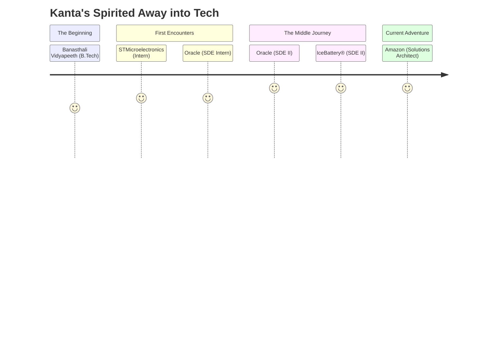

#  Kanta's Enchanted Tech Forest

<div align="center">
  
  

  <p><em>"In this world, there's no such thing as 'useless' code. Even the tiniest functions have a purpose." — The Kanta Version of Totoro</em></p>
</div>


## 🌱 The Wandering Spirit Coder

Namaste! I'm Kanta, a curious spirit like Chihiro, discovering magical realms through code. Just as Howl crafts his moving castle from seemingly impossible parts, I architect AI solutions that transform wild ideas into tangible reality.

- 🍄 **Current Adventure**: Solutions Architect @ Amazon, crafting Generative AI wonders
- 🌊 **Previous Voyages**: Software Developer II @ IceBattery® and Oracle
- 🌟 **Spirit Guide for**: Women in STEM, making the coding realm accessible to all wanderers
- 🌿 **Founded**: Women in AI/ML Nashville Chapter, a sanctuary for fellow tech explorers
- 🦉 **Knowledge Sharing**: Guest Speaker at Vanderbilt University & Presenter at AWS re:Invent
- 🐱 **My Catbus**: Building bridges between human needs and technical solutions
- 📝 **Send a Paper Plane**: parathasarathijugnu@gmail.com

## 💫 Magic Spells & Incantations

```
"Once you've met technology, you never really forget it. It just takes a while for it to come back to you." - Kanta's Spirited Code
```

<details>
<summary>🧙‍♀️ My Magical Grimoire (Tech Stack)</summary>
<br>

### 🌈 Full-Stack Enchantments


### 🔮 Generative AI Sorcery


### 🏯 Cloud Architecture


### 🎨 UX Design Artistry


### 🌊 Programming Rivers


</details>

## 🍃 Journey Through The Magical Forest

<div align="center">
  <!--  -->
</div>



## 🌸 Achievements & Treasures Found

<div style="background-color: #F3EED9; border-radius: 10px; padding: 15px; margin: 10px 0;">

- 🏆 **AWS Certified Solutions Architect** – Like finding Laputa's crystal
- 🔮 **Architecting with Google Compute Engine** – A magic spell learned from the cloud spirits
- 🌟 **Xamarin Forms in Android and iOS** – Creating portals between different realms
- 🏯 **Google Cloud Essentials** – Building castles in the digital sky
- 🦉 **AWS re:Invent Presenter** – Sharing wisdom like Yubaba's sister Zeniba
- 🎓 **Vanderbilt University Guest Lecturer** – Teaching young spirits about the tech forest
- 🌈 **Pratibha Eaton Excellence Awards** – Acknowledged by the forest spirits
- 🌱 **National Scholarship** – The wind brought this gift

</div>

## 🌿 Languages of Different Realms
- 🇮🇳 Hindi (Like a forest spirit, native to the land)
- 🇺🇸 English (Fluent as flowing water)
- 🇫🇷 French (Like Howl visiting different doors)
- 🇰🇷 Korean (Beginning to understand the whispers)

## 🎋 "Only you can find your way through the forest of code." — The Kodama of DevOps

<div align="center">
 <!--  -->
  
  ### ✨ Let's build something as magical as Howl's Moving Castle! ✨
  
  [](https://www.linkedin.com/in/kantagarg17)
  [](https://medium.com/@kantagarg17)
  [](mailto:parathasarathijugnu@gmail.com)
  [](tel:+17186124304)


</div>


<!-- 
Studio Ghibli Aesthetic Elements:
1. Color palette inspired by nature scenes (soft greens, earthy tones)
2. Wave patterns like water and wind elements common in films
3. Original quotes inspired by Ghibli but tailored to tech
4. Tech skills organized like magical abilities and spells
5. Journey visualization representing character growth
6. Nature-themed section dividers and rounded elements
7. Earthy badge colors that evoke forest settings
-->
